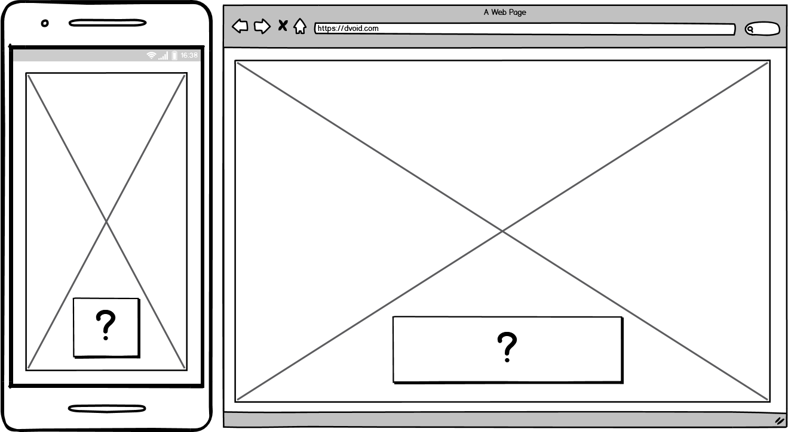
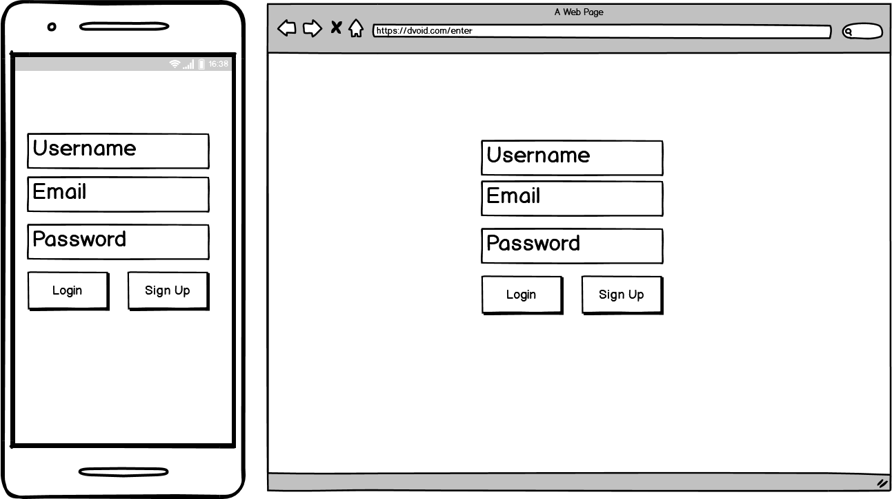
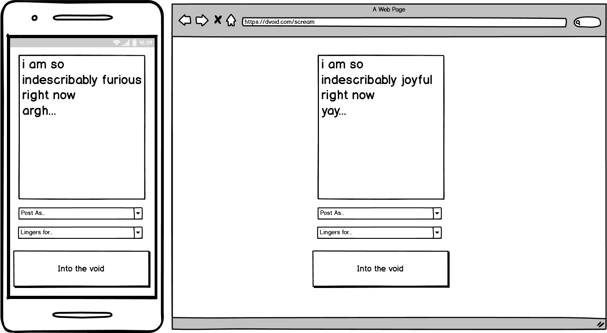
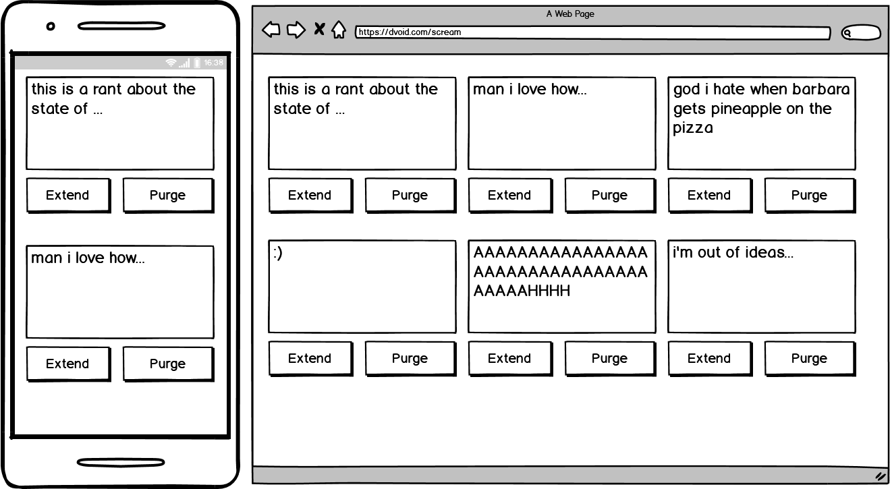

# Dvoid

---  

### [Link to Trello Board](https://trello.com/b/IhepBGwR/dvoid)  

---  

### Description  

**Yell into the void.**  

Scream anonymously to be heard by anyone until it is lost.  
When you vent, rant or confess into the void until it can be seen only as long as you choose until it is permanently removed.  

---  

### Installation Steps

This app is written in Python 3.8, which can be installed (along with its related packages) on Unix like systems using:  
```bash
apt-get install python3.8 python3.8-venv python3-pip
```  

To clone a fresh copy of the repo, use the command:  
```bash
git clone https://github.com/eric-chew/dvoid
```  

Then change your current working directory into the project:  
```bash
cd dvoid
```  

Initialise a virtual environment:  
```bash
python3.8 -m venv venv
```  

Then activate the virtual environment:  
```bash
source venv/bin/activate
```  

Install the required dependencies:  
```bash
pip3 install -r requirements.txt
```  

Then you can run the app:
```bash
python src/main.py
```  

---

### Wireframes  

##### Main Page / **The Void**  

Landing page, contains a (randomised?) selection of messages cast to the void. This is where a creative soul can go crazy with the presentation.  
The '?' button refreshes the pages/updates the selection of messages.

  

##### Login/Sign-in  

Simple, standard entry point to the app.  

  

##### Cast into the Void  

Where messages for the void are composed.  
Users have the option to post as their username or anonymously.  
Users can also choose for how long their message will remain in the void before being permanently deleted.  

  

##### The Void stares back

Overview of the existing messages the user has in the void.  
Each contains the original message and a timer for how long the message will continue to exist for before being permanently deleted.  
Users also have the option to extend the time a message is in the void or pre-emptively have them removed.  

  

